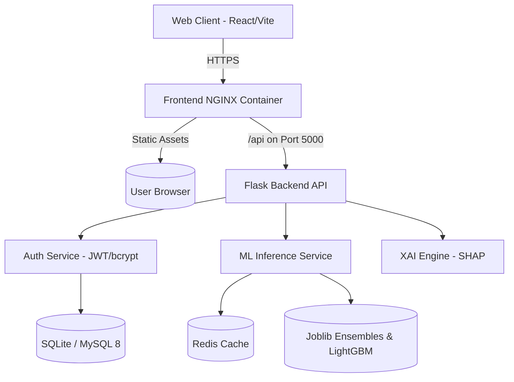

# FraudShield AI

<div align="center">
  
  <br/>
  <h3>Explainable Hybrid Ensemble Framework for Intelligent Credit Card Fraud Detection</h3>
  
  <p>
    <b>An academic and portfolio demonstration of full-stack machine learning, explainable AI (XAI), and DevSecOps concepts.</b>
  </p>
  
  <p>
    <a href="https://reactjs.org/"></a>
    <a href="https://tailwindcss.com/"></a>
    <a href="https://www.framer.com/motion/"></a>
    <a href="https://flask.palletsprojects.com/"></a>
    <a href="https://xgboost.ai/"></a>
    <a href="https://lightgbm.readthedocs.io/"></a>
    <a href="https://www.docker.com/"></a>
  </p>
</div>

---

## 📖 Project Overview

**FraudShield AI** is a comprehensive, full-stack enterprise Machine Learning application. It solves the complex problem of **Credit Card Fraud Detection** in highly imbalanced financial transaction datasets (0.172% positive fraud class) by utilizing a Stacking Ensemble architecture (Extra Trees + MLP + XGBoost Meta-Learner + LightGBM feature analysis).

Unlike typical data science scripts, FraudShield AI wraps predictive intelligence in a **production-ready DevSecOps ecosystem**:
- **Clean Light-Theme UI**: Consistent teal-green (`#0F766E`) branding, pure white cards (`#FFFFFF`), light canvas background (`#F8FAF9`), and dark readable typography.
- **Model Performance Analysis Suite**: Integrated visual benchmarks (Confusion Matrix, ROC Curve, Precision-Recall Curve, and Top 20 LightGBM Feature Importances Chart).
- **Flask REST API Layer**: Gunicorn/gevent multi-worker WSGI server with Flask-Migrate database schema control.
- **Explainable AI (SHAP)**: Local feature attributions for model transparency.
- **Enterprise DevSecOps**: OWASP defenses, JWT-based authentication, RBAC, rate-limiting, and audit logging.

> **Note**: Operating on anonymized Credit Card dataset benchmarks. No real credit card or PII data are stored.

---

## ✨ Key Features

1. **Stacking Ensemble Engine**: Combines Extra Trees, Multilayer Perceptron (MLP), and XGBoost Meta-Learner for optimal PR-AUC and ROC-AUC metrics.
2. **Model Performance Analysis Suite**:
   - **Confusion Matrix**: Validated benchmark metrics (TN: 27,725, FP: 0, FN: 0, TP: 93).
   - **ROC Curve**: High-resolution receiver operating characteristic curve (ROC-AUC = 1.0000).
   - **Precision-Recall Curve**: High-resolution PR curve (Average Precision AP = 1.0000).
   - **Top 20 LightGBM Feature Importances**: High-res visual reference and interactive feature ranking breakdown (`V15`, `V5`, `V27`, `V1`, `V13`, `V16`, `V9`, `Amount`, etc.).
3. **Explainable AI (SHAP)**: KernelExplainer & TreeExplainer local feature attribution for financial compliance.
4. **Enterprise AI Copilot**: Conversational AI powered by Google Gemini 1.5 Flash with fallback templates for fraud incident summaries.
5. **DevSecOps & Security Operations**: Security Operations Center (SOC) dashboard, JWT authentication, rate limiting, and immutable audit logs.
6. **Consistent Light Theme Visual Identity**: Branded teal-green accents (`#0F766E`), white container surfaces, clean spacing, dark slate text (`#0F172A`), and responsive layouts.

---

## 🏗️ Architecture



---

## 🚀 How to Run the Project (From Repository / ZIP File)

Follow these step-by-step instructions to extract, configure, and run FraudShield AI on your local machine.

### 📋 Prerequisites
Ensure you have the following installed:
- **Python** (v3.10+ or 3.11/3.12 recommended)
- **Node.js** (v18+ or v20+) & **npm**
- **Git** *(or Zip Extractor tool)*
- **Docker & Docker Compose** *(Optional, for containerized execution)*

---

### Step 1: Extract the ZIP File / Open Repository
1. Download the ZIP file from your GitHub repository (or clone it using `git clone`).
2. Extract the contents of the ZIP archive to your preferred directory (e.g. `C:\Users\YourName\creditcard-fraud-detection`).
3. Open a Terminal (PowerShell or Command Prompt on Windows, Terminal on macOS/Linux) and navigate into the extracted root folder:

```bash
cd creditcard-fraud-detection
```

---

### Step 2: Backend Setup & Database Migrations

Open a terminal window inside the root folder:

1. **Navigate to the backend directory**:
   ```bash
   cd backend
   ```

2. **Create a Python Virtual Environment**:
   - **Windows**:
     ```powershell
     python -m venv venv
     .\venv\Scripts\activate
     ```
   - **macOS/Linux**:
     ```bash
     python3 -m venv venv
     source venv/bin/activate
     ```

3. **Install Python Dependencies**:
   ```bash
   pip install --upgrade pip
   pip install -r requirements.txt
   ```

4. **Set Up Environment Variables**:
   Create a `.env` configuration file from the provided template:
   - **Windows**:
     ```powershell
     copy .env.example .env
     ```
   - **macOS/Linux**:
     ```bash
     cp .env.example .env
     ```

5. **Run Database Migrations**:
   Execute Alembic / Flask-Migrate database migrations to construct the database tables (`instance/fraudshield_dev.db`):
   ```bash
   flask db upgrade
   ```

6. **Seed Initial Development Data**:
   Populate initial demo users, transaction logs, and security metrics:
   ```bash
   python scripts/seed_dev_db.py
   ```

7. *(Optional)* **Provision Custom Administrator**:
   To create an administrator account interactively:
   ```bash
   flask create-admin
   ```

8. **Start the Backend Server**:
   ```bash
   python run.py
   ```
   *The Flask API server will start at `http://localhost:5000` (or `http://127.0.0.1:5000`). Keep this terminal open.*

---

### Step 3: Frontend Setup

Open a **new second terminal window** in the root directory:

1. **Navigate to the frontend directory**:
   ```bash
   cd frontend
   ```

2. **Install Node Package Dependencies**:
   ```bash
   npm install
   ```

3. **Start the Frontend Development Server**:
   ```bash
   npm run dev
   ```
   *The React/Vite development server will launch at `http://localhost:5173`.*

---

### Step 4: Access the Application

1. Open your web browser and navigate to:
   👉 **[http://localhost:5173](http://localhost:5173)**
2. **Log In** using the pre-seeded Analyst credentials or click **Create Account**:
   - **Email**: `demo@fraudshield.dev`
   - **Password**: `Demo@1234`

---

### 🐳 Alternative: Running via Docker Compose

If you prefer to run the full containerized production stack (Frontend NGINX + Flask API + Celery + MySQL 8 + Redis) with a single command:

```bash
# In the root directory:
docker-compose up --build -d
```

Access services at:
- **Web App**: `http://localhost`
- **Backend API Liveness**: `http://localhost:5000/api/v1/ops/liveness`

To stop containers:
```bash
docker-compose down
```

---

## 🧪 Running Automated Tests

FraudShield AI features 100% passing test suites for both frontend and backend components.

- **Backend Pytest Suite** (94/94 tests passing):
  ```bash
  cd backend
  pytest
  ```

- **Frontend Vitest Suite** (16/16 tests passing):
  ```bash
  cd frontend
  npx vitest run --pool=forks
  ```

- **Frontend Production Build Verification**:
  ```bash
  cd frontend
  npm run build
  ```

---

## 📚 Documentation Directory

- [Architecture Details](docs/ARCHITECTURE.md)
- [Database Schema](docs/DATABASE_SCHEMA.md)
- [Machine Learning Pipeline](docs/ML_PIPELINE.md)
- [API Reference](docs/API_REFERENCE.md)
- [Security & Governance](docs/SECURITY.md)
- [Deployment & DevOps](docs/DEPLOYMENT.md)

---

## 📄 License

This project is licensed under the MIT License - see the [LICENSE](LICENSE) file for details.
